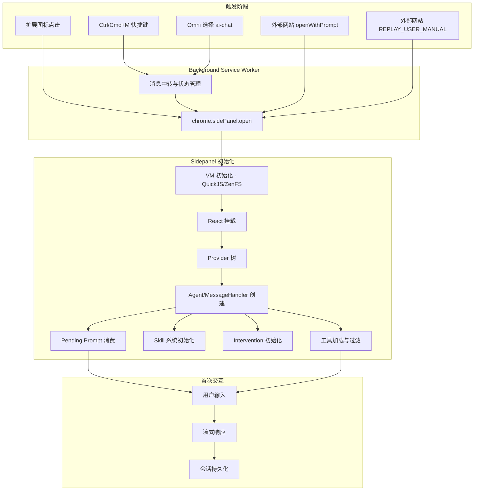

# Sidepanel 入口链路：new-aipex vs aipex 缺口分析

> **目的**：从 sidepanel 入口出发，系统梳理 `new-aipex` 相比 `aipex` 在端到端链路上的不足之处，为后续补齐工作提供可执行清单。
>
> **生成日期**：2026-02-15

---

## 1. 对比基线与评估维度

| 项目 | 根路径 | 入口文件 |
|------|--------|----------|
| aipex（旧版，全功能） | `aipex/` | `src/sidepanel.tsx` → `ChatBot`（2800+ 行单体组件） |
| new-aipex（新版，模块化） | `new-aipex/packages/` | `browser-ext/src/pages/sidepanel/index.tsx` → `app-root.tsx` → `ChatBot`（组件化 + hooks） |

**评估维度**：触发与打开 / 初始化与配置加载 / 消息桥接 / Agent 与工具 / 会话持久化 / 会话历史 / 回放链路 / UI 功能 / 服务依赖 / 错误处理 / 可观测性

---

## 2. Sidepanel 端到端链路对比

### 2.1 链路流程图

### 2.2 新旧链路步骤对照

| 阶段 | aipex (旧版) | new-aipex (新版) | 差异 |
|------|-------------|-----------------|------|
| **触发 → 打开** | `chrome.action.onClicked` / `open-aipex` 快捷键 / content script `open-sidepanel` / `openWithPrompt` / `REPLAY_USER_MANUAL` | `chrome.action.onClicked` / `open-aipex` 快捷键 / content script 无 `open-sidepanel` / `openWithPrompt` | 缺少 `REPLAY_USER_MANUAL` 外部触发 |
| **选中文本传递** | `open-sidepanel` 可携带 `selectedText` → `get-selected-text` 取回 | 无此机制 | **缺失** |
| **VM 初始化** | `initializeVM()` — QuickJS + ZenFS | 同 | 一致 |
| **React 挂载** | `ReactDOM.createRoot` → `SidepanelApp` | `renderChatApp()` → `App` | 一致 |
| **Provider 树** | `ThemeProvider → I18nProvider → ChatBot` | `I18nProvider → ThemeProvider → AuthProvider → ChatApp` | 新版多了 `AuthProvider` |
| **配置加载** | `useStorage` 逐个读 `aiHost/aiToken/aiModel` + 等待 `isLoading*` | `useChatConfig({ storageAdapter })` 统一读取 | 新版更简洁 |
| **Agent 创建** | `new MessageHandler(config)` — 含 `DefaultBackgroundContextManager` + `getAllTools()` + `filterToolsByMode` | `useAgent({ settings, modelFactory, storage, contextProviders, tools })` → `AIPex.create()` | 架构不同但功能对等 |
| **工具加载** | `getAllTools()` — 约 70+ MCP 工具 | `allBrowserTools` — 32 个注册工具 | **缺口：~50 个工具未暴露** |
| **Skill 初始化** | `skillManager.initialize()` + 订阅 `skill_enabled/skill_disabled` | VM 层初始化 skill；无显式事件订阅 | 事件订阅缺失 |
| **Intervention 初始化** | `interventionManager.initialize()` + 5 个事件监听 (start/complete/cancel/timeout/error) | `InterventionModeProvider` + `InterventionUI` 组件化 | 功能对等但实现方式不同 |
| **Pending Prompt** | `useEffect` 检查 `aipex-pending-prompt` → `setInput()` | `usePendingPrompt()` hook → `initialInput` prop | 一致 |
| **Port 长连接** | `chrome.runtime.connect({ name: 'sidepanel' })` | 同 | 一致 |
| **Visibility 清理** | `visibilitychange` → `stop-recording` + `stop-capture` | 同 | 一致 |
| **模型列表** | `fetchModels()` → 手动管理 `models` state + 自定义模型追加 | `fetchModelsForSelector()` 在 InputArea 内自动加载 + BYOK 自定义模型 | 新版更灵活 |
| **Conversation 呼吸边框** | heartbeat → `aipex-conversation-active` → content script 边框 | 同（`useConversationHeartbeat`） | 一致 |
| **流式输出** | `MessageHandler._startStream` — 手动 fetch + `StreamingParser` | `AIPex.chat()` → `AsyncGenerator<AgentEvent>` → `ChatAdapter` | 新版架构更清晰 |
| **会话持久化** | `ConversationStorage` (IndexedDB, LRU 5 条) | `conversationStorage` (IndexedDB, LRU 5 条) + debounced auto-save | 一致 |
| **会话历史 UI** | `ConversationHistory` 组件 (header 内) | `ConversationHistory` 组件 (BrowserChatHeader 内) | 一致 |
| **Replay 链路** | `NAVIGATE_AND_SETUP_REPLAY` 监听 → `UseCaseDetail` 页面 | 不存在 | **完全缺失** |
| **Chat 图片导出** | sidepanel 内 `provide-current-chat-images` listener | `ChatImagesListener` 组件 | 一致 |

---

## 3. 缺口清单

### GAP-01: Replay 外部触发链路缺失

| 属性 | 值 |
|------|-----|
| **现象** | 旧版支持外部网站发送 `REPLAY_USER_MANUAL` → background 转发 `NAVIGATE_AND_SETUP_REPLAY` → sidepanel 接收并跳转到 `UseCaseDetail`。新版 `background.ts` 和 sidepanel 中均不存在这两个消息类型。 |
| **证据** | 旧版 `aipex/src/background.ts` L3151-3199（`REPLAY_USER_MANUAL`）；`aipex/src/lib/components/chatbot/index.tsx` L1373-1424（`NAVIGATE_AND_SETUP_REPLAY` listener）。新版 `rg "REPLAY_USER_MANUAL\|NAVIGATE_AND_SETUP_REPLAY" new-aipex/` → 零匹配。 |
| **影响** | claudechrome.com 网站上的 "Replay Manual" 功能无法调起新版扩展。 |
| **优先级** | **P1** |
| **建议** | 在 `background.ts` `onMessageExternal` 和 sidepanel ChatApp 中补齐消息协议。 |

---

### GAP-02: 未迁移的后台服务

| 属性 | 值 |
|------|-----|
| **现象** | 旧版多个与 sidepanel 功能关联的后台服务在新版中不存在。 |
| **证据** | `new-aipex/migration/LOGIC_INCONSISTENCIES_BY_PACKAGE.md` 第 4.2 节。 |
| **影响** | |

| 缺失服务 | 旧版路径 | 影响范围 |
|----------|---------|---------|
| `version-checker.ts` | `aipex/src/lib/services/version-checker.ts` | 无法检测扩展新版本并通知用户 |
| `web-auth.ts` | `aipex/src/lib/services/web-auth.ts` | 旧版 Cookie-based auth 辅助函数缺失（新版有 `AuthProvider` 替代，但功能不完全对等） |
| `recording-upload.ts` | `aipex/src/lib/services/recording-upload.ts` | 无法将录屏上传到托管服务 |
| `screenshot-upload.ts` | `aipex/src/lib/services/screenshot-upload.ts` | 无法将截图上传到托管服务 |
| `user-manuals-api.ts` | `aipex/src/lib/services/user-manuals-api.ts` | 无法从服务端获取用户手册数据 |
| `replay-controller.ts` | `aipex/src/lib/services/replay-controller.ts` | 无法执行步骤回放控制 |

| **优先级** | **P1**（auth 相关）/ **P2**（其余） |
| **建议** | 按依赖顺序逐步迁移到 `packages/browser-ext/src/services/` 或新建 `packages/services`。 |

---

### GAP-03: Voice 输入仅支持 Web Speech API

| 属性 | 值 |
|------|-----|
| **现象** | 旧版支持三层 STT 降级：Server STT → ElevenLabs → Web Speech API。新版仅保留 Web Speech API。 |
| **证据** | `new-aipex/migration/LOGIC_INCONSISTENCIES_BY_PACKAGE.md` 第 2.7 节。新版 `packages/aipex-react/src/components/voice/VoiceInput.tsx` 和 `packages/browser-ext/src/lib/browser-chat-input-area.tsx` 仅使用 Web Speech。 |
| **影响** | 非英语语言识别准确率下降；BYOK 用户无法使用 ElevenLabs 高精度识别。 |
| **优先级** | **P1** |
| **建议** | 在 `packages/aipex-react/src/lib/voice/` 中恢复 ElevenLabs + Server STT 路径。 |

---

### GAP-04: Install 时自动打开引导页缺失

| 属性 | 值 |
|------|-----|
| **现象** | 旧版 `onInstalled` 在 production 环境下会自动打开 `https://www.claudechrome.com` 引导用户。新版仅打日志。 |
| **证据** | 旧版 `aipex/src/background.ts` L1082-1089；新版 `new-aipex/packages/browser-ext/src/background.ts` L31-39。 |
| **影响** | 新用户安装后无引导体验。 |
| **优先级** | **P2** |
| **建议** | 在 `onInstalled` install 分支中恢复引导页打开逻辑。 |

---

### GAP-05: React ErrorBoundary 缺失

| 属性 | 值 |
|------|-----|
| **现象** | 新版 sidepanel 的 React 组件树中没有包裹 `ErrorBoundary`。任何渲染错误会导致整个 sidepanel 白屏。 |
| **证据** | `rg "ErrorBoundary" new-aipex/` → 零匹配。旧版同样缺少，但旧版组件更少、更稳定。 |
| **影响** | Agent 工具回调中的渲染错误、异步组件加载失败等场景会导致不可恢复的白屏。 |
| **优先级** | **P1** |
| **建议** | 在 `app-root.tsx` 的 `<App />` 外层包裹 `ErrorBoundary`，提供友好的错误恢复 UI。 |

---

### GAP-06: Skill 系统事件订阅缺失

| 属性 | 值 |
|------|-----|
| **现象** | 旧版在 ChatBot 初始化时显式订阅 `skillManager` 的 `skill_enabled` / `skill_disabled` 事件。新版 VM 初始化了 skill 系统，但 sidepanel UI 层未订阅 skill 变更事件。 |
| **证据** | 旧版 `aipex/src/lib/components/chatbot/index.tsx` L1313-1325（`skillManager.subscribe`）。新版 `app-root.tsx` 和 `chatbot.tsx` 中无 skill 事件订阅。 |
| **影响** | Skill 启用/禁用后 UI 可能无法实时反映变化（例如 skill tag 不更新）。 |
| **优先级** | **P2** |
| **建议** | 在 ChatApp 或 ChatBot 内添加 `skillManager` 事件订阅并传播到 UI。 |

---

### GAP-07: Share（分享对话）功能缺失

| 属性 | 值 |
|------|-----|
| **现象** | 旧版 sidepanel header 包含"分享"和"保存为 Skill"按钮。新版 `BrowserChatHeader` 中无此功能。 |
| **证据** | 旧版 `aipex/src/lib/components/chatbot/index.tsx` 中存在 `handleShareConversation`（L1744-1793）和 `handleSaveAsSkill`（L1796-1798）。新版 `browser-chat-header.tsx` 中无对应功能。 |
| **影响** | 用户无法分享当前对话或将对话保存为可复用的 Skill。 |
| **优先级** | **P2** |
| **建议** | 在 `BrowserChatHeader` 中添加分享与 Skill 保存入口。 |

---

## 4. 缺口优先级汇总

| 优先级 | 缺口编号 | 简述 |
|--------|---------|------|
| **P1** | GAP-01 | Replay 外部触发链路缺失 |
| **P1** | GAP-03 | Voice 输入仅 Web Speech API |
| **P1** | GAP-05 | React ErrorBoundary 缺失 |
| **P2** | GAP-02 | 未迁移的后台服务 |
| **P2** | GAP-04 | Install 引导页缺失 |
| **P2** | GAP-06 | Skill 事件订阅缺失 |
| **P2** | GAP-07 | 分享 / 保存为 Skill 功能缺失 |

---

## 5. 补齐路线建议

### Phase 1（P1 — 功能完整性）

1. **补齐 Replay 外部触发** — background 中处理 `REPLAY_USER_MANUAL`，sidepanel 中监听 `NAVIGATE_AND_SETUP_REPLAY`。
2. **恢复 Voice 多层 STT** — 在 voice engine 中添加 ElevenLabs 和 Server STT 路径。
3. **添加 ErrorBoundary** — `app-root.tsx` 顶层包裹。

### Phase 2（P2 — 体验优化）

4. Install 引导页、Skill 事件订阅、分享/Skill 保存、后台服务迁移。

---

## 6. 安全评审卡

### 6.1 入口与信任边界

| 入口 | 信任级别 | 校验机制 |
|------|---------|---------|
| `chrome.action.onClicked` | 可信（用户主动触发） | 无需额外校验 |
| `chrome.commands` 快捷键 | 可信（用户主动触发） | 无需额外校验 |
| Content script → `open-sidepanel` | 半可信（content script 上下文） | Background 仅执行 `sidePanel.open`，不传递数据 |
| `onMessageExternal` (`openWithPrompt`) | 外部来源 | `manifest.json` `externally_connectable` 限制来源域名；prompt 类型校验 (`typeof === "string"`)；timestamp 过期丢弃（5s TTL）|
| `onMessageExternal` (`REPLAY_USER_MANUAL`) | 外部来源 | **旧版已有** — `externally_connectable` 域名白名单；**新版缺失** — 需补齐时同步实现。 |

### 6.2 外部消息校验路径

- `openWithPrompt`：prompt 必须为 `string` 类型 + 非空；通过 `chrome.storage.local` 中转（非直接注入 UI），sidepanel 消费时检查 timestamp（<5s）。**状态：已实现，安全。**
- `REPLAY_USER_MANUAL`：**新版缺失**，补齐时需确保 `steps` 数组做 schema 校验，防止注入恶意步骤数据。

### 6.3 敏感数据与日志

- `aiToken` 存储在 `chrome.storage.local`，UI 中未展示明文。新版 `AIPex.sanitizeErrorMessage()` 内建 Bearer token / API key 脱敏。**状态：安全。**
- 旧版大量 `console.log` 包含 emoji debug 信息，可能泄露会话内容。新版日志更精简。**建议**：production build 时移除或降级 debug 日志。

### 6.4 高风险工具默认策略

- 旧版所有 MCP 工具默认暴露；新版通过 `allBrowserTools` 白名单控制，且 `filterToolsByMode` 在 background 模式下过滤 computer/screenshot 工具。**状态：新版更安全。**

### 6.5 待验证测试点

- [ ] `ErrorBoundary` 添加后的错误恢复行为
- [ ] `REPLAY_USER_MANUAL` 补齐后的 steps 数据校验
- [ ] Production build 日志级别控制
- [ ] BYOK 自定义模型的 `aiHost` URL 校验（防 SSRF）
- [ ] `externally_connectable` 域名列表与实际部署域名一致性

---

> **交叉引用**：本文档与以下已有迁移文档互补
> - `migration/TOOL_SURFACE_AUDIT.md` — 工具级对比详表
> - `migration/LOGIC_INCONSISTENCIES_BY_PACKAGE.md` — 按包的逻辑差异
> - `migration/MIGRATION_STRATEGY.md` — 整体迁移规划
